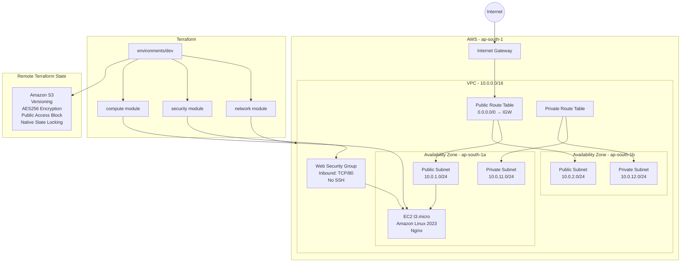

# Architecture

## Overview

This project provisions a modular AWS infrastructure foundation in the `ap-south-1` region using Terraform.

The architecture is intentionally production-oriented while remaining cost-conscious for a portfolio environment.

## Architecture Diagram



## Network Architecture

The network module creates:

- One custom VPC using CIDR `10.0.0.0/16`
- Two public subnets across two Availability Zones
- Two private subnets across two Availability Zones
- One Internet Gateway
- One public route table
- One private route table
- Route table associations for all four subnets

Public subnets automatically assign public IP addresses.

Private subnets do not automatically assign public IP addresses.

A NAT Gateway was intentionally not included because the temporary portfolio workload does not require outbound connectivity from private subnets and avoiding it reduces unnecessary AWS cost.

## Security Architecture

The security module creates a dedicated web security group.

Inbound access:

- TCP port 80 from the internet

Public SSH access is intentionally not configured.

Outbound traffic is permitted for the temporary demonstration workload.

## Compute Architecture

The compute module:

- Dynamically retrieves a current Amazon Linux 2023 AMI using an AWS data source
- Creates a temporary `t3.micro` EC2 instance
- Deploys the instance into the first public subnet
- Associates the web security group
- Uses Terraform `user_data` to install and start Nginx
- Publishes a simple validation page

The workload exists only to prove that the Terraform-created network and security infrastructure operates correctly.

## Terraform Module Flow

```text
environments/dev
      |
      +--> network module
      |      |
      |      +--> VPC
      |      +--> Subnets
      |      +--> Internet Gateway
      |      +--> Route Tables
      |
      +--> security module
      |      |
      |      +--> Security Group
      |
      +--> compute module
             |
             +--> Amazon Linux AMI data source
             +--> EC2
             +--> Nginx user_data
```

Terraform references module outputs to establish dependencies between infrastructure components.

For example:

```text
network.vpc_id
      ↓
security module
      ↓
security_group_id
      ↓
compute module
```

## Application Traffic Flow

```text
Internet
   ↓
Internet Gateway
   ↓
Public Route Table
   ↓
Public Subnet
   ↓
Security Group (TCP/80)
   ↓
EC2
   ↓
Nginx
```

## Remote State Architecture

Terraform state is stored remotely in Amazon S3.

The backend configuration includes:

- S3 remote state
- Server-side AES256 encryption
- Bucket versioning
- Public access blocking
- Native S3 Terraform state locking

State path:

```text
dev/terraform.tfstate
```

The S3 backend is created separately through the `bootstrap` Terraform configuration before the main environment is initialized.

## Module Structure

```text
modules/
├── network/
├── security/
└── compute/
```

This separation keeps infrastructure reusable and makes responsibilities clear.

### Network Module

Responsible for:

- VPC
- Public subnets
- Private subnets
- Internet Gateway
- Route tables
- Route associations

### Security Module

Responsible for:

- Web security group
- HTTP ingress rules
- Outbound rules

### Compute Module

Responsible for:

- AMI discovery
- EC2 workload
- Nginx bootstrap configuration

## Design Decisions

This project intentionally does not include:

- NAT Gateway
- Application Load Balancer
- RDS
- ECS
- ElastiCache

Those services were unnecessary for demonstrating the Terraform engineering objectives of this project and would create avoidable cost and complexity.

The focus is instead on:

- Modular Infrastructure as Code
- Secure remote state
- State locking
- Reusable Terraform modules
- Multi-AZ network design
- Security boundaries
- Resource dependencies
- Drift detection
- Infrastructure validation
- Controlled cleanup
